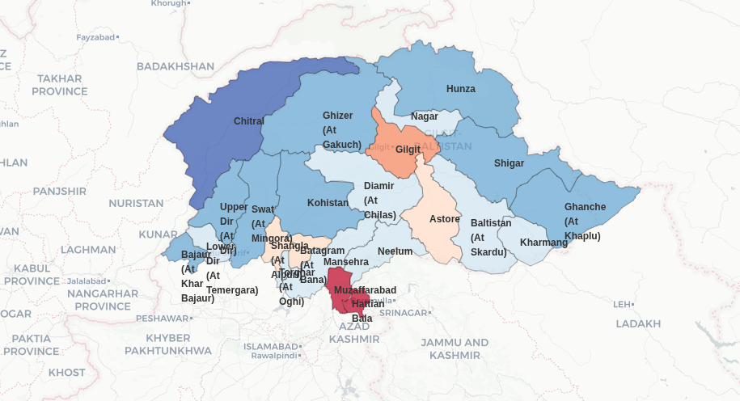

# Snow Cover & Surface Energy Flux Analysis: Northern Pakistan (2015-2025)

[](https://www.python.org/downloads/)
[](https://jupyter.org/)
[](LICENSE)



---

## 📖 Overview

Comprehensive spatial-temporal analysis of snow cover dynamics and surface energy fluxes across 23 districts in northern Pakistan. This study quantifies climate change impacts on regional snow hydrology through advanced geospatial statistics and interactive visualizations.

### Key Results
- **15-20% decadal snow depth reduction** in high-elevation central districts (Gilgit, Nagar)
- **Significant spatial clustering** (Moran's I = 0.42 for snowfall, p < 0.01)
- **Strong energy-snow coupling** (r = 0.89 between snowfall and snowmelt)
- **Post-2020 acceleration** in snowmelt patterns across 80% of districts

---

## 🎯 Research Objectives

1. Quantify snow cover metrics using high-resolution data
2. Analyze spatial autocorrelation and identify hotspot districts
3. Assess relationships between snow dynamics and surface energy fluxes
4. Evaluate climate change impacts on regional water resources

---

## 📊 Methodology


### Variables Analyzed
**Snow Metrics**: Cover (%), Snowfall (m), Snowmelt (m), Depth (m)  
**Energy Fluxes**: Latent Heat (J/m²), Solar Radiation (J/m²), Sensible Heat (J/m²), Albedo

### Analytical Framework

#### Spatial Processing
- District-level aggregation via polygon clipping
- Year-over-year temporal differencing
- Period comparison: 2015-2019 vs 2020-2024

#### Statistical Methods
- **Global Moran's I**: Spatial autocorrelation (KNN k=4)
- **LISA**: Local indicators of spatial association
- **OLS Regression**: Snowmelt ~ Energy fluxes with spatial weights
- **Correlation Analysis**: Pearson coefficients for variable relationships

#### Visualization Techniques
- Interactive time series with uncertainty bands
- Climate projection-style historical/observed comparisons
- Animated choropleths with temporal sliders
- Multi-panel comparison maps (2015-2019 vs 2020-2024)
- Moran scatterplots for spatial structure
- Funnel charts for district rankings

---

## 🔬 Key Findings

### 1. Temporal Trends

**Snow Cover**: Oscillating pattern with peak in 2019, followed by recent decline (mean change: -1.8% ± 0.91%)

**Snowfall**: High inter-annual variability with spikes in 2019 and 2024; overall negative trend (mean: -1.0 ± 0.54)

**Snowmelt**: 2019 peak followed by decline, strong recovery to 2025; highest variability among metrics (mean: -0.66 ± 0.47)

**Latent Heat Flux**: Gradual increase until 2023, sharp drop in 2024 (mean: -67,700 ± 28,760 J/m²)

**Key Pattern**: Distinct regime shift pre-2020 vs post-2020 across all variables

### 2. Spatial Autocorrelation

```
Snowfall (2020-2024)
  Moran's I: 0.42 (p = 0.003) → Significant clustering

Snowmelt (2020-2024)
  Moran's I: 0.21 (p = 0.026) → Significant clustering
```

**Interpretation**: Snow patterns are spatially structured, not random. Adjacent districts experience similar changes.

**LISA Hotspots** (p < 0.05):
- **High-High**: Lower Dir, Upper Dir (high snowmelt surrounded by high)
- **High-Low**: Diamir (high snowmelt island)
- **Low-Low**: Muzaffarabad, Neelum (southern coldspot)

### 3. Energy-Snow Relationships

**Strongest Correlations (2024)**:
| Variable Pair | r | Interpretation |
|---------------|---|----------------|
| Snowfall ↔ Snowmelt | 0.89 | Very strong positive |
| Latent Heat ↔ Solar Rad | -0.89 | Very strong negative |
| Snow Depth ↔ Snow Cover | 0.88 | Very strong positive |
| Snowmelt ↔ Latent Heat | 0.41 | Moderate positive |

**Regression Model**:
```
Snowmelt = f(Latent Heat, Solar Radiation, Albedo)
R² = 0.25, Adjusted R² = 0.13
```
Energy fluxes explain 25% of snowmelt variance; topography and precipitation timing also critical.

### 4. Geographic Heterogeneity

**Extreme Snow Depth Loss**:
- Nagar: -9241%
- Gilgit: -9241%
- Diamir: -2241%

**Moderate Changes**: Most districts -559% to +245%

**Stable Districts**: Chitral, Hunza, Shigar (western region)

**Pattern**: West-to-east gradient with central mountain core most affected

### 5. Period Comparison (2015-2019 vs 2020-2024)

**Snow Cover**: Central districts (Gilgit, Nagar, Diamir, Astore, Baltistan) shifted from blue (moderate) to orange (+2-3 units increase)

**Snowfall**: Complete pattern reversal
- 2015-2019: Western districts high (Chitral, Bajaur)
- 2020-2024: Eastern districts high (Ghanche, Baltistan, Shigar)

**Snowmelt**: Intensification and eastward expansion
- Gilgit core remains hotspot
- Spread to Baltistan, Astore

**Latent Heat**: 2-5× increase in central districts (Ghizer, Gilgit, Nagar, Diamir)

---

## 📈 District Rankings

### Top 5 Snowmelt Increase (2020-2024)
1. Chitral (+0.074 × 10⁴)
2. Bajaur (-0.096 × 10⁴)
3. Upper Dir (-0.191 × 10⁴)
4. Hunza (-0.203 × 10⁴)
5. Shigar (-0.289 × 10⁴)

### Top 5 Snowmelt Decrease
1. Hattian Bala (-1.837 × 10⁴) ⚠️
2. Muzaffarabad (-1.475 × 10⁴) ⚠️
3. Gilgit (-1.394 × 10⁴) ⚠️
4. Kharmang (-1.126 × 10⁴) ⚠️
5. Astore (-0.973 × 10⁴) ⚠️

---

## 🌍 Climate & Water Resource Implications

### Evidence of Climate Change
1. **Accelerating trends**: Post-2020 period shows distinct patterns
2. **Extreme snow loss**: 9000%+ reduction in core districts
3. **Energy balance shifts**: Doubling of latent heat flux
4. **Spatial reorganization**: West-to-east pattern reversal

### Water Security Concerns
- **80% of districts** show reduced snowmelt
- **Peak timing shifts** likely (requires sub-annual analysis)
- **Indus River impacts**: Reduced spring snowmelt contribution
- **Agriculture vulnerability**: Irrigation water availability

### Priority Districts for Intervention
1. **Gilgit** - Extreme snow loss + LISA hotspot
2. **Nagar** - Extreme snow loss
3. **Hattian Bala** - Largest snowmelt decrease
4. **Muzaffarabad** - High vulnerability
5. **Diamir** - Spatial anomaly (high-low cluster)

---

## 💻 Technical Implementation

### Installation
```bash
git clone https://github.com/Saif3985/pakistan-snow-analysis.git
cd pakistan-snow-analysis
pip install -r requirements.txt
```

### Dependencies
```python
pandas>=1.3.0
geopandas>=0.10.0
xarray>=0.19.0
rioxarray>=0.8.0
plotly>=5.0.0
matplotlib>=3.4.0
esda>=2.4.0
libpysal>=4.6.0
spreg>=1.2.0
```

### Notebook Structure
1. **Data Loading**
2. **Spatial Processing**: Clipping, aggregation, differencing
3. **Temporal Analysis**: Time series with uncertainty quantification
4. **Spatial Statistics**: Moran's I, LISA, regression
5. **Visualization**: 20+ interactive Plotly figures
6. **Results Summary**: Statistics tables and interpretation

### Key Code Features
- Automated district-level extraction loop
- Dynamic time series statistics computation
- Spatial weights matrices (KNN k=4)
- Multi-panel comparison maps
- Climate projection-style plotting function
- Animated choropleth with temporal slider

---

## 📊 Visualization Gallery

The notebook contains 20+ publication-quality visualizations:

### Temporal Analysis
- Multi-panel time series (Snow Cover, Snowfall, Snowmelt, Latent Heat)
- Climate projection plots with historical/observed split
- Annual change plots with uncertainty bands

### Spatial Patterns
- Side-by-side period comparison maps (2015-2019 vs 2020-2024)
- Snowmelt trend change map
- Decadal snow depth percentage change
- Animated choropleth (2016-2025)

### Statistical Graphics
- Moran's I scatterplots (Snowfall, Snowmelt)
- LISA cluster maps
- Correlation heatmap (6×6 matrix)
- Pairwise scatterplot matrix

### Rankings & Comparisons
- District rankings bar chart (all 23 districts)
- Funnel chart (Top 10 districts)
- Summary statistics tables

All visualizations are interactive (Plotly) with hover details, zoom, and export capabilities.


---

## 🔄 Future Directions

1. **Sub-annual analysis**: Monthly/seasonal decomposition
2. **Elevation stratification**: High-resolution DEM integration (SRTM/ASTER)
3. **Downscaling**: Machine learning for sub-district resolution
4. **Hydrological modeling**: Streamflow predictions (SWAT/VIC)
5. **Ground validation**: Field campaigns in hotspot districts
6. **Climate scenarios**: RCP/SSP projections to 2050
7. **Socioeconomic impacts**: Agriculture, hydropower vulnerability

---

## 🤝 Contributing

Contributions welcome! Areas of interest:
- Additional climate variables (temperature, precipitation)
- Advanced spatial models (GWR, SAR)
- Alternative data sources (MODIS snow cover, in-situ observations)
- Improved visualizations
- Code optimization

Please fork, create feature branch, and submit pull request.


---

## 📧 Contact

**Author**: Saif Ullah  
**Email**: saifullahct5@gmail.com  
**GitHub**: [@Saif3985](https://github.com/Saif3985)  
**LinkedIn**: [linkedin.com/in/saifullah-ds](https://www.linkedin.com/in/saifullah-ds)

---

## 🙏 Acknowledgments

- **Pakistan Meteorological Department** for regional insights
- **Open-source community**: GeoPandas, PySAL, Plotly developers

---

## 📊 Summary Statistics (2020-2024)

| Variable | Mean | Std Dev | Min | Max | Unit |
|----------|------|---------|-----|-----|------|
| Snow Cover | -1.80 | 0.91 | -3.93 | -0.10 | % |
| Snowfall | -1.00 | 0.54 | -2.09 | -0.10 | m × 10⁴ |
| Snowmelt | -0.66 | 0.47 | -1.84 | 0.07 | m × 10⁴ |
| Latent Heat | -67,700 | 28,760 | -117,299 | 5,062 | J/m² |

**Interpretation**: Negative means indicate overall declining trends across all snow metrics. High standard deviations reflect strong spatial heterogeneity.

---

## 🎓 Citation

If you use this analysis in your research, please cite:

```bibtex
@misc{pakistan_snow_2025,
  title={Snow Cover and Surface Energy Flux Analysis: Northern Pakistan (2015-2025)},
  author={Saif Ullah},
  year={2025},
  publisher={GitHub},
  journal={GitHub repository},
  howpublished={\\url{https://github.com/Saif3985/pakistan-snow-analysis}}
}
```

---

*Last Updated: May 2025*  
*Version: 1.0*  

---

